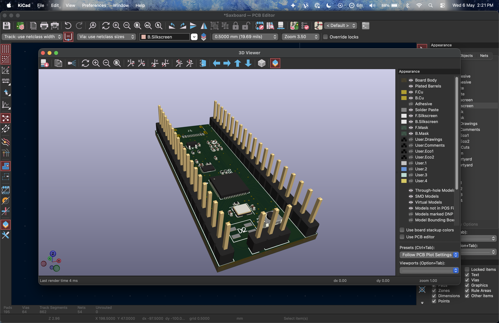
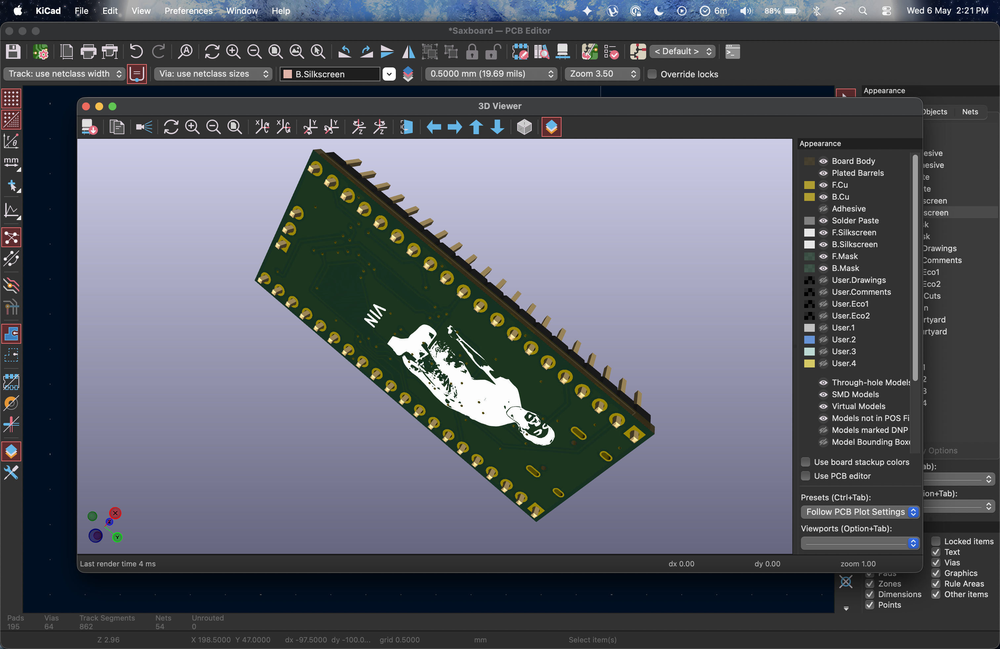
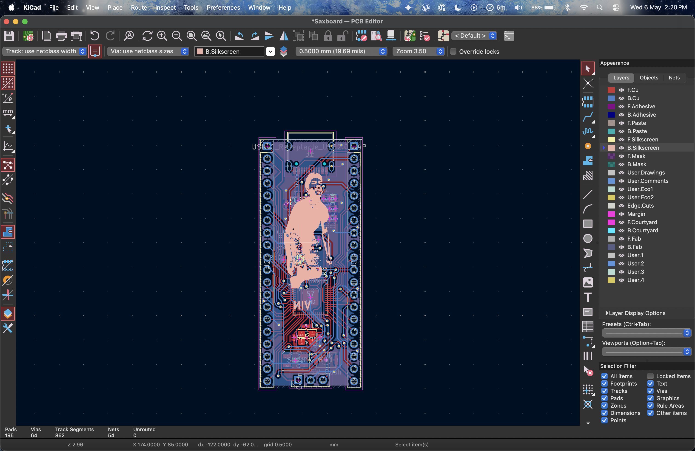
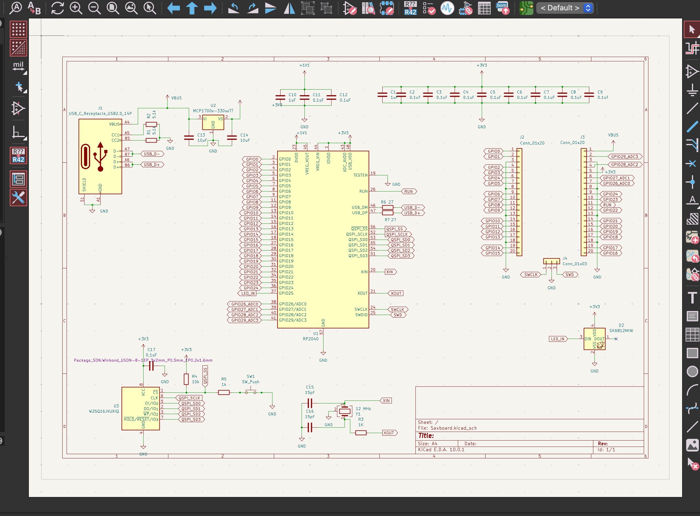

# DevBoard

Custom RP2040-based development board for embedded systems and hardware prototyping.

## Images

### Front



### Back


### PCB


### Schematic


---

## Features

- RP2040 Microcontroller
- USB Support
- GPIO Breakout
- I2C / SPI / UART
- Custom PCB Design

---

## Repository Structure

```text
devboard/
│
├── grb/
├── image/
├── kicad/
├── grb.zip
└── README.md
```

---

## Files

- `grb/` → Gerber manufacturing files
- `image/` → Board images and schematic
- `kicad/` → KiCad design files
- `grb.zip` → Exported Gerber archive

---

## Author

Created by [AYUSH-pro-grammer](https://github.com/AYUSH-pro-grammer)
